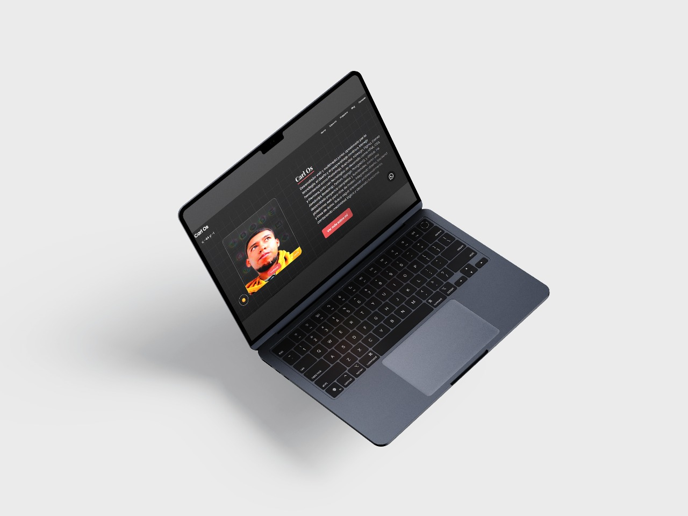

#  Portafolio Personal - Django + Railway + PostgreSQL + AWS S3

Proyecto **Portafolio** desarrollado en **Django 5**, desplegado en **Railway** con base de datos **PostgreSQL**, y preparado para manejar archivos estáticos y multimedia en **AWS S3**.

---

##  Características principales

- Backend en **Django 5**
- Base de datos **PostgreSQL** (Railway)
- Servidor de producción con **Gunicorn**
- Variables de entorno seguras (Railway)
- Archivos estáticos gestionados con `collectstatic`
- Preparado para usar **AWS S3** (para imágenes y archivos)
- Panel de administración mejorado con **Jazzmin**

---

## ⚙️Requisitos

- Python 3.10 o superior  
- pip  
- virtualenv  
- Cuenta en [Railway.app](https://railway.app)  
- (Opcional) Cuenta en AWS S3 para almacenamiento

---

##  Instalación local

1. **Clonar el repositorio**
   ```bash
   git clone 
   cd portafolio

## **Galeria**





